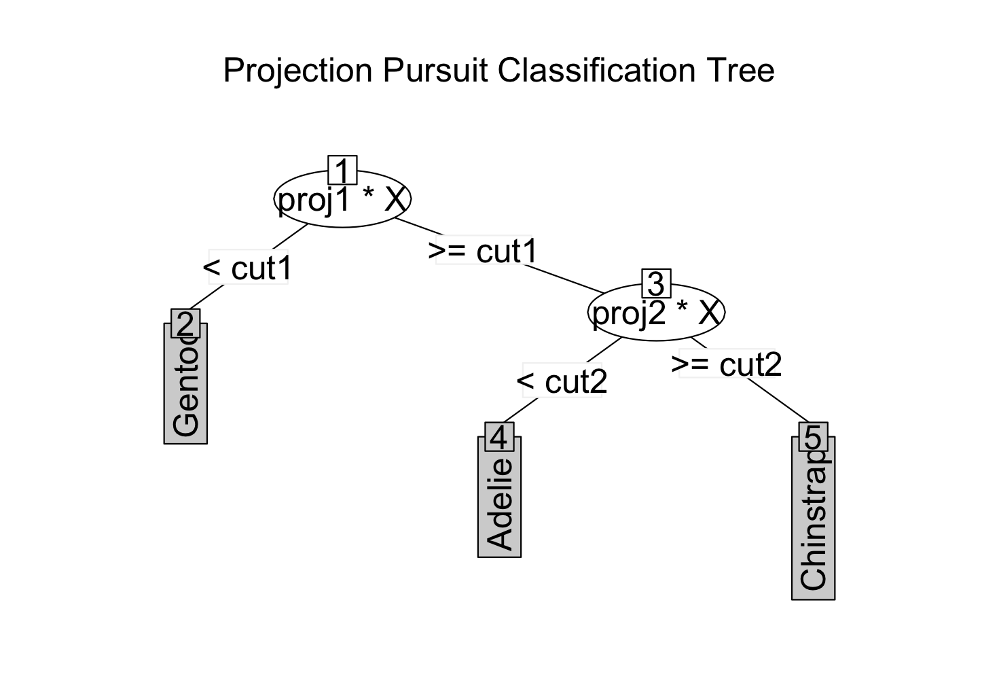

<!-- README.md is generated from README.Rmd. Please edit that file -->
# PPtreeExt

PPtreeExt is an R package with extensons to the Projection Pursuit Tree (PPtree) algorithm to improve its performance in multi-class settings and under nonlinear separations.
The PPtree classifier finds separations between classes  based on linear combinations of variables by optimizing a projection pursuit index. One of its limitations is a rigid structure: the depth of a PPtree object is at most
$G$-1, where $G$ is the number of classes, with each class assigned to a single terminal node.
The proposed modifications enhance predictive performance in multi-class contexts, particularly in situations involving outliers or asymmetries. The objective is to increase the classifier's flexibility to handle more complex scenarios, while retaining interpretability.
The package includes an interactive web application to explore the behavior of the original and modified PPtree classifiers under a variety of scenarios.
This interactive tool played a key role in identifying limitations of the original algorithm and informing the design of the proposed modifications.


## Installation

Install version from CRAN (not available yet!): 

```r
install.packages("PPTreeExt")
```

Install the development version from GitHub:
```r
# install.packages("devtools")
devtools::install_github("natydasilva/PPtreeExt")
```
---

## Simple Example

```r
set.seed(234)
data(penguins)
penguins <- na.omit(penguins[, -c(2,7, 8)])
require(rsample)
penguins_spl <- rsample::initial_split(penguins, strata=species)
penguins_train <- training(penguins_spl)
penguins_test <- testing(penguins_spl)
penguins_ppt <- PPtreeExtclass(species~bill_len + bill_dep +
flipper_len + body_mass, data = penguins_train, PPmethod = "LDA", tot=nrow
(penguins_train), tol =  0.2 , srule = TRUE)
============================================================= 
Projection Pursuit Classification Tree Extension result 
=============================================================

1) root
   2)* proj1*X < cut1  ->  "Gentoo"
   3)  proj1*X >= cut1
      4)* proj2*X < cut2  ->  "Adelie"
      5)* proj2*X >= cut2  ->  "Chinstrap"

Error rates 
-------------------------------------------------------------
[1] 1

pred<- predict(object = penguins_ppt, newdata = penguins_test[,-1], true.class = penguins_test$species)
 
 
pred$predict.error
[1] 2

pred$predict.class
  [1] "Adelie"    "Adelie"    "Adelie"    "Adelie"    "Adelie"    "Adelie"   
 [7] "Adelie"    "Adelie"    "Adelie"    "Adelie"    "Adelie"    "Adelie"   
[13] "Adelie"    "Adelie"    "Adelie"    "Adelie"    "Adelie"    "Adelie"   
[19] "Adelie"    "Adelie"    "Adelie"    "Adelie"    "Adelie"    "Adelie"   
[25] "Adelie"    "Adelie"    "Adelie"    "Adelie"    "Adelie"    "Adelie"   
[31] "Adelie"    "Adelie"    "Adelie"    "Adelie"    "Adelie"    "Adelie"   
[37] "Adelie"    "Adelie"    "Gentoo"    "Gentoo"    "Gentoo"    "Gentoo"   
[43] "Gentoo"    "Gentoo"    "Gentoo"    "Gentoo"    "Gentoo"    "Gentoo"   
[49] "Gentoo"    "Gentoo"    "Gentoo"    "Gentoo"    "Gentoo"    "Gentoo"   
[55] "Gentoo"    "Gentoo"    "Gentoo"    "Gentoo"    "Gentoo"    "Gentoo"   
[61] "Gentoo"    "Gentoo"    "Gentoo"    "Gentoo"    "Gentoo"    "Gentoo"   
[67] "Gentoo"    "Gentoo"    "Gentoo"    "Chinstrap" "Chinstrap" "Chinstrap"
[73] "Chinstrap" "Chinstrap" "Adelie"    "Chinstrap" "Chinstrap" "Chinstrap"
[79] "Chinstrap" "Chinstrap" "Chinstrap" "Chinstrap" "Chinstrap" "Adelie"   
[85] "Chinstrap" "Chinstrap"

```

```r
plot(penguins_ppt)
```



